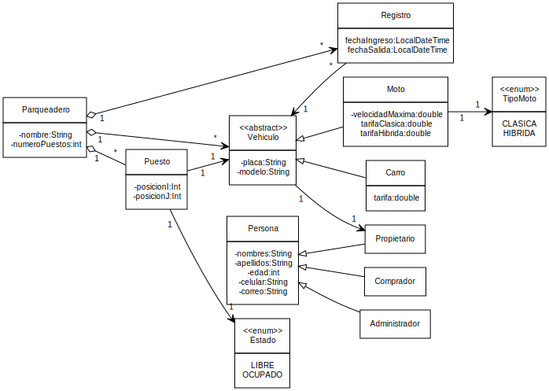
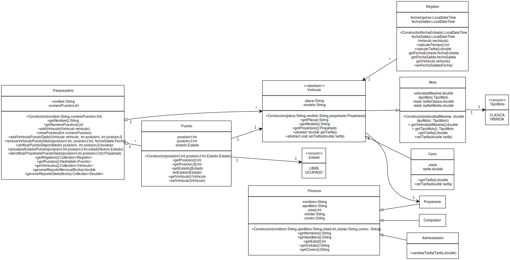

<h1 style="color: gray">Proyecto final</h1>

<h5 style="color: gray">Jaider Andrés Melo, Yerilin Ul Yalanda y Juan Jose Mendez 
Programa de Ingeniería de Sistemas y Computación 
Facultad de Ingeniería
</h5>

<b>
Problema:  
Administración de parqueadero 
</b>

---

Se desea desarrollar una aplicación para la administración eficiente de un parqueadero. El parqueadero cuenta con un numero n de puestos, cada uno identificado por una posición única (i, j). Cada puesto puede estar ocupado por un vehículo, que puede ser de tipo moto (clásica o híbrida) o carro, y debe tener una placa, un modelo y un propietario registrado en el sistema.

Para las motos, se debe registrar también su velocidad máxima, ya que el parqueadero es frecuentado por compradores de motos usadas interesados en conocer este dato. Un vehículo solo puede ocupar un puesto a la vez, por lo que se debe verificar la disponibilidad del precio antes de ubicar un vehículo en él.

---

El sistema debe llevar un registro completo de todos los vehículos que han parqueado en el establecimiento, incluyendo información sobre el puesto ocupado y el momento ingresado. Además, debe permitir la identificación del propietario de un vehículo ubicado en un puesto dado y llevar un registro de todos los ingresos al parqueadero, registrando el puesto ocupado y el vehiculo ocupado en el mismo.

La implementación del parqueadero debe hacer uso de herencia para una mejor organización y reutilización del código.

---

**Las funcionalidades del parqueadero son:**

- El sistema debe permitir la creación de un parqueadero con un numero de puestos.
- Cada puesto debe tener una posición (i, j) y puede estar ocupado por un vehículo.
- Un vehiculo puede ser de tipo moto (clásica o híbrida) o carro, y debe tener una placa, un modelo y un propietario.
- Si el vehículo es una moto, se debe registrar su velocidad máxima.
- El sistema debe permitir verificar si un puesto está ocupado por un vehiculo y si un puesto está disponible.
- El sistema debe llevar un registro de todos los vehículos que han parqueado en el parqueadero.

---

- Se debe poder identificar al propietario de un vehículo ubicado en un puesto dado.
- El sistema debe llevar un registro de todos los ingresos al parqueadero, incluyendo el puesto ocupado y el vehículo ubicado en el mismo.
- Un vehículo solo puede ocupar un puesto en un momento dado.
- Para que un vehículo se ubique en un puesto, el puesto debe estar vacío.
- Se debe establecer una tarifa por hora de uso del parqueadero para cada tipo de vehículo (moto clásica, moto híbrida o carro).
- El sistema debe calcular el costo total de establecimiento de un vehículo basado en el tiempo de uso y la tarifa por hora correspondiente a su tipo.

---

- Se debe permitir que el administrador del parqueadero pueda configurar las tarifas por hora para cada tipo de vehiculo.
- El sistema debe ser capaz de generar un reporte diario y mensual del dinero recaudado en el parqueadero.
- El reporte diario debe incluir el total recaudado en ese dia, desglosado por tipo de vehículo (moto clásica, moto híbrida o carro).

---

**Entregable:**
- El sistema debe seguir el principio de desarrollo dirigido por pruebas (TDD).
- Código fuente en github.
- Aplicar los principios de la programación orientada a objetos.
- Documentación detallada del diseño y funcionamiento del sistema.

**Nota:** Si para el desarrollo del proyecto se crea interfaz gráfica de usuario en JavaFX se obtendrá bonificación, tanto en el proyecto como en seguimiento.

---

- **Parqueadero**:
  - nombre: Texto
  - numeroPuestos: entero

- **Puesto**:
  - posicionI: entero
  - posicionJ: entero

- **Estado**:
  - LIBRE
  - OCUPADO

---

- **Vehiculo**:
  - placa: Texto
  - modelo: Texto

- **Carro**:
  - tarifa: Real

- **Moto**:
  - velocidadMaxima: Real
  - tarifaClasica: Real
  - tarifaHibrida: Real

---

- **TipoMoto**:
  - CLASICA
  - HIBRIDA

- **Registro**:
  - fechaEntrada: Fecha
  - fechaSalida: Fecha

- **Persona**:
  - nombres: Texto
  - apellidos: Texto
  - edad: Entero
  - celular: Texto
  - correo: Texto

---

---

- **Parqueadero**

  - Almacenar puestos
  - añadir vehiculos a puestos
  - eliminar vehiculos de puestos
  - verificar si un puesto está disponible
  - actualizar el estado de un puesto
  - generar un reporte diario del dinero recaudado
  - generar un reporte mensual del dinero recaudado
  - identificar el propietario de un puesto

---

- **Registro**
  - calcular el tiempo (horas) que un vehiculo ha estado estacionado.
  - calcular la tarifa que un vehiculo debe pagar dependiendo de la tarifa del vehiculo y el numero de horas estacionado.

- **Vehiculo** (**Carro** y **Moto**)
  - obtener la tarifa dependiendo de su instancia.
  - cambiar la tarifa dependiendo de su instancia.
  
---

- **Administrador**
  - cambiar la tarifa de un vehiculo y se le cambie a todas las instancias de este.
  
---

---

- Almacenar datos de prueba
- Recuperar los datos de prueba
- Verificar que los datos almacenados coinciden con los datos recuperados

---

Clase: **Vehiculo**

| Prueba                                | Entrada de datos                                          | Salida (Resultado)                                                                                  |
|---------------------------------------|-----------------------------------------------------------|-----------------------------------------------------------------------------------------------------|
| Datos completos de una moto | se crea una Moto con sus datos completos| Se obtiene sus datos exitosamente |
| Datos completos de un carro | Se crea un Carro con sus datos completos| Se obtienen sus datos exitosamente |
| Datos nulos de una moto | se  intenta crear una Moto con sus datos nulos| Error: los datos de la moto no pueden ser nulos |
| Datos nulos de un carro | Se intenta crear un Carro con sus datos nulos| Error: los datos de la moto no pueden ser nulos |
| Datos negativos de una moto | se intenta crea una moto con datos negativos| Error: la velocidad maxima de la moto debe ser positiva |

Clase: **Propietario**

| Prueba                                | Entrada de datos                                          | Salida (Resultado)                                                                                  |
|---------------------------------------|-----------------------------------------------------------|-----------------------------------------------------------------------------------------------------|
| Datos completos de un propietario | Se crea un Propietario con sus datos completos| Se obtienen sus datos exitosamente |
| Datos nulos de un propietario | Se intenta crea un Propietario con sus datos nulos| Error, no se puede crear un propietario con sus datos nulos |
| Datos vacíos de un propietario | Se intenta crea un propietario sus datos vacíos| Error, no se puede crear un propietario con sus datos vacíos |
| propietario menor de edad | se intenta crea un propietario menor de edad| Error: el propietario debe ser mayor de edad |

---

Clase: **Puesto**

| Prueba                                | Entrada de datos                                          | Salida (Resultado)                                                                                  |
|---------------------------------------|-----------------------------------------------------------|-----------------------------------------------------------------------------------------------------|
| Datos completos de un puesto | Se crea un puesto con sus datos completos| Se obtiene sus datos exitosamente |
| Datos negativos y nulos de un puesto | Se intenta crea un puesto con su posicion negativa y su estado nulo| Error, no se puede crear un puesto con sus datos nulos ni negativos |

Clase: **Parqueadero**

| Prueba                                | Entrada de datos                                          | Salida (Resultado)                                                                                  |
|---------------------------------------|-----------------------------------------------------------|-----------------------------------------------------------------------------------------------------|
| Datos completos de un parqueadero | Se crea un parqueadero con sus datos completos| Se obtienen sus datos exitosamente |
| Añadir vehiculos diferentes | Se añaden vehiculos a diferentes puestos| se obtienen los el estado de los puestos exitosamente |
| Añadir un vehiculo a un puesto ocupado | Se intenta añadir un vehiculo a un puesto en donde ya hay un vehiculo| Error, no se puede añadir un vehiculo a un puesto que está ocupado |

---

Clase: **Parqueadero**

| Prueba                                | Entrada de datos                                          | Salida (Resultado)                                                                                  |
|---------------------------------------|-----------------------------------------------------------|-----------------------------------------------------------------------------------------------------|
| crear puestos | Se crea un parqueadero con un numero de puestos positivo| Se obtiene el numero de puestos exitosamente |
| Generar un reporte de un parqueadero sin vehículos | Se crea un parqueadero y se genera el reporte diario y mensual sin vehiculos| Se obtienen los reportes con valores de cero |
| Generar un reporte de un parqueadero con vehiculos | Se crea un parqueadero y se genera el reporte diario con vehiculos| Se obtienen los reportes con diferentes valores según la instancia de vehiculo |
| Calcular tarifa de un vehiculo despues de x horas | Se crea un parqueadero y se genera un reporte mensual de los vehiculos según la cantidad de horas estacionado y su instancia de vehiculo| Se obtiene un total de dinero dada la suma de los valores de cada vehiculo |

---

Clase: **Parqueadero**

| Prueba                                | Entrada de datos                                          | Salida (Resultado)                                                                                  |
|---------------------------------------|-----------------------------------------------------------|-----------------------------------------------------------------------------------------------------|
| Identificar el propietario de un vehiculo estacionado | Se usa el método para identificar el propietario de un vehiculo según su posicion| Se obtiene el propietario del vehiculo exitosamente dada su posicion |
| Identificar el propietario de un puesto sin vehículo | Se usa el método para identificar el propietario de un vehiculo según su posicion| Error: no se ha encontrado ningún vehículo |

---

- **¿Cómo pruebo la solución?**

  - Almacenar datos de prueba de un estudiante. 
  - Recuperar datos de prueba de un estudiante. 
  - Verificar que los datos almacenados coinciden con los datos recuperados

- **Cómo escribo la solución en Java?**

  Ver la carpeta del *src* en el proyecto de **Visual Studio Code**

---

<!-- 
_header: ''
_footer: '' 
_paginate: false
_backgroundImage: url('imagenes/gracias.png')
-->
